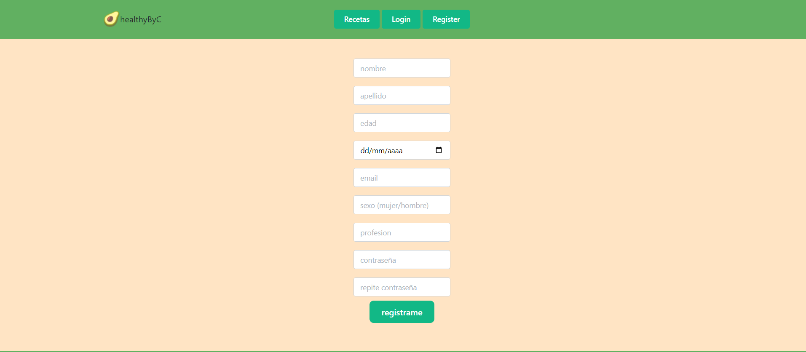
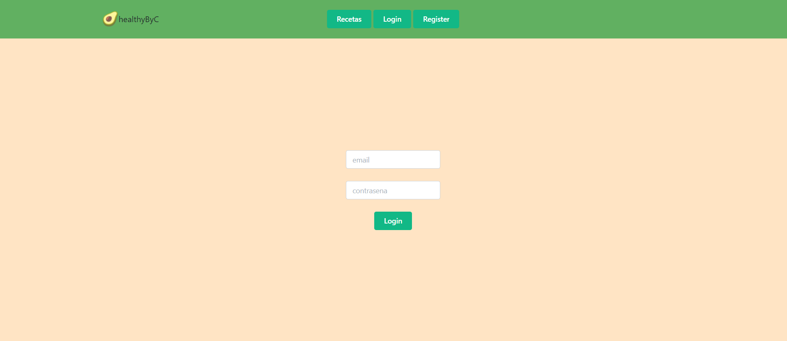
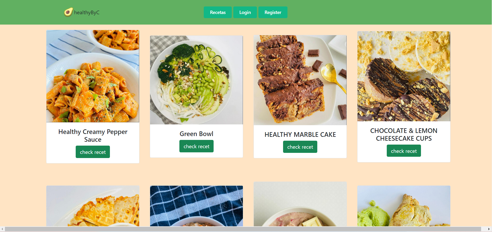
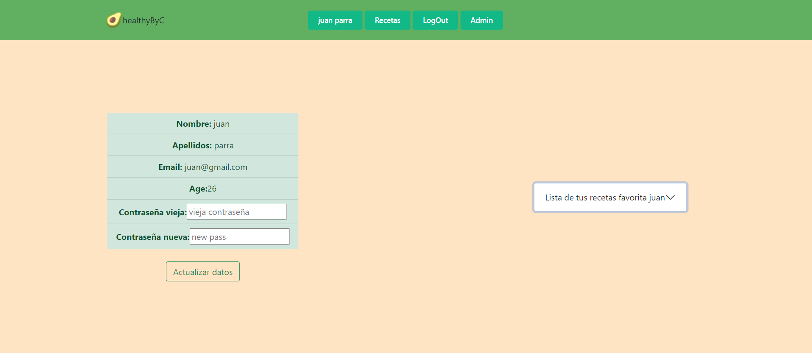

# Proyecto Frontend de HealthyByC

Este proyecto consiste en crear una web donde la nutricionista Caterina Carrasquero, mejor conocida como HealthyByC pueda mostrar sus recetas de comidas saliudables , mostrando que ingredientes se necesitaran y como prepararlas.

### Proyecto deployado en: 

https://master.df6nkyfgw0e9.amplifyapp.com/

### Tecnologias usadas:

### Bienvenida 

La pagina princiapl te muestra quien es HealthyByC, con las opciones en ek encabezado de registrarte, loguearte, y ver las recetas, y unas imagenes de algunas recetas que te encontraras mas adelante al buscar tus recetas.

### Registro
Para registrarnos, debemos clickar sobre register y nos redirigirá a la vista de registro, donde podremos introducir nuestros datos para crear un usuario. Se cuidadoso cuando rellenes el formulario porque los campos tinen medidas de seguridad para asegurarse de que no habra errores cuando se guarden tus datos.

### Login 

Una vez nos hemos registrado, nos redirigirá a la vista de Login, donde deberemos introducir nuestro email y nuestro password con los que nos hemos registrado previamente.

### Recetas

A continuacion puedes ir a recetas para ver cuales hay disponibles y ver si alguna te provoca,  si alguna te gusta puedes revisarla haciendo click sobre ella y y despues puedes darle a adquirirla para que te quede guardada en tu perfil, en caso de que quieras recordarla puedes ir a tu perfil y revisar su nombre y volver a buscarla dandole al boton de recetas.

### Perfil

si vas a tu perfil puedes ver tus datos como nombre, apellido, correo, numero de telefono y edad, asi como tambien todas las recetas que has adquirido. En caso de querer actualizar tu contraseña puedes hacerlo escribiendolo en el campo y dandole al boton de actualizar.

### Futuras incorporaciones

Muy pronto los usuarios podran otorgarle sus datos a la nutricionista para que ella les pueda hacer una dieta personalizada de acuerdo a las especificaciones
que el mismo usuario le otorgue y con sus objetivos deteticos.

